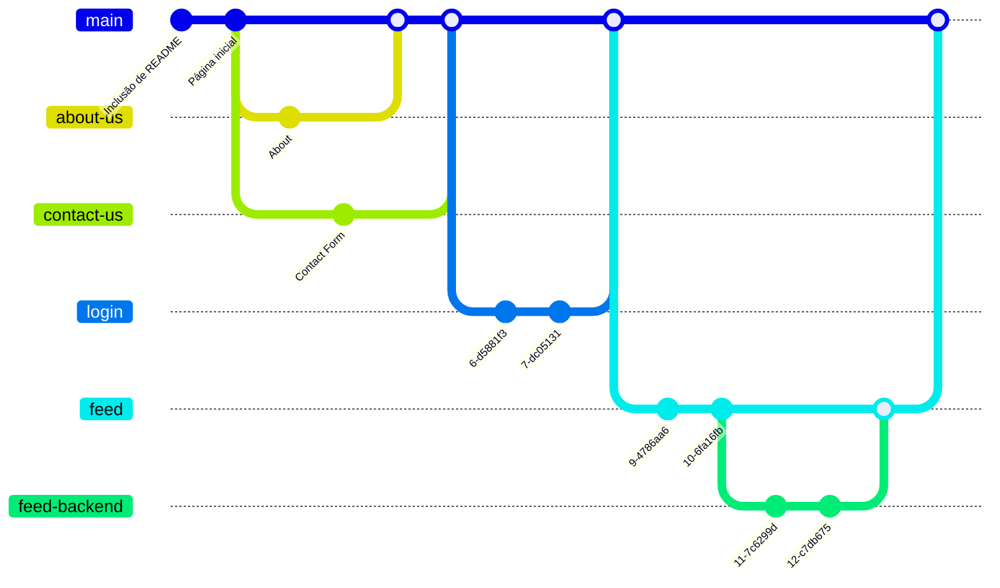

# Git

## Fluxo básico de controle de versão

### Incializar um repositório

> A partir de um diretório, execute o comando abaixo

```shell
git init
```

# Proposta de Fluxo com Controle de versão
## TCC
